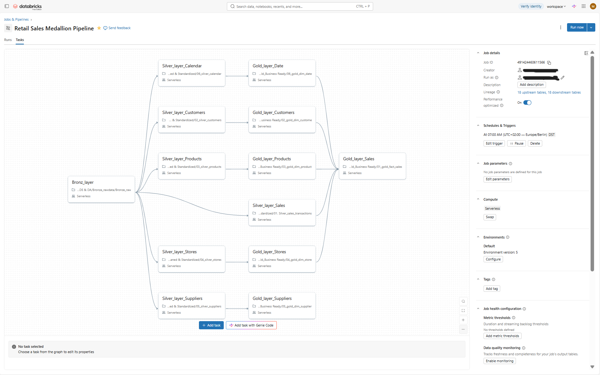

# Retail Sales Performance Analytics | Databricks End-to-End Project

## Project Overview

This project demonstrates an **end-to-end Data Engineering and Data Analytics solution in Databricks**, transforming raw retail data into business-ready insights.

The project covers the complete lifecycle:

**Raw Data → Data Engineering Pipeline → Gold Data Model → SQL Analytics → AI/BI Dashboard → Genie Agent**

The analysis focuses on sales performance, profitability, products, customers, stores, regions, discounts, returns, and cancellations.

---

## Step 1 — Data Engineering & Medallion Pipeline

I built an end-to-end data pipeline using the **Databricks Medallion Architecture**.

Six source datasets were used:

- Sales Transactions
- Customers
- Products
- Stores
- Suppliers
- Calendar

The data flows through three layers:

**Bronze → Silver → Gold**

- **Bronze:** Raw data ingestion and storage.
- **Silver:** Data cleaning, duplicate removal, missing-value handling, validation, and standardization.
- **Gold:** Business-ready fact and dimension tables for analytics.

The complete workflow was orchestrated using **Databricks Jobs & Pipelines**, with task dependencies and scheduled execution.



---

## Step 2 — Gold Data Model

After cleaning and transforming the data, I created an analytics-ready dimensional model.

**Fact Table**
- `fact_sales`

**Dimension Tables**
- `dim_customer`
- `dim_product`
- `dim_store`
- `dim_supplier`
- `dim_date`

```text
                 dim_customer
                      |
dim_date -------- fact_sales -------- dim_product
                      |                    |
                  dim_store           dim_supplier
```

The model follows a **star schema with a supplier snowflake extension**.

Business measures including **Revenue, Cost, Profit, Discounts, and Cancelled Value** were prepared in the Gold layer.

---

## Step 3 — SQL Analytics

Using the Gold data model, I created SQL queries for both **KPI calculations and detailed business analysis**.

### Key KPIs

- Total Revenue
- Total Cost
- Total Profit
- Profit Margin %
- Total Orders
- Units Sold
- Average Order Value
- Total Customers
- MoM Growth
- YoY Growth

### Business Analysis

The analysis covers:

- Sales and profitability trends
- Product and category performance
- Customer segment and loyalty performance
- Top products and customers
- Regional and store performance
- Discount impact
- Returns and cancellations

The SQL queries are organized into **KPI Queries** and **Analysis Queries** folders in this repository.

---

## Step 4 — Databricks AI/BI Dashboard

I developed a three-page interactive **Retail Sales Performance Dashboard** using Databricks AI/BI.

### Page 1 — Executive Sales Overview

Provides executive KPIs, revenue and profit trends, category performance, regional performance, and order status analysis.


### Page 2 — Product & Customer Analysis

Analyzes top products, customer segments, customer loyalty, discount impact, and high-value customers.


### Page 3 — Trend & Regional Performance

Analyzes regional growth, profitability, store performance, returns, and cancellations.


---

## Step 5 — Databricks Genie Agent

Finally, I configured a **Retail Sales & Customer Insights Genie Agent** using the curated Gold-layer data.

The Agent enables natural-language exploration of business data and can answer questions such as:

- Which products generated the highest revenue?
- Which region has the highest profit margin?
- Which customer segment contributes the most revenue?
- How have revenue and profit changed over time?
- Which regions have the highest return and cancellation rates?

The Agent was configured with the Gold tables, table relationships, business definitions, and analytical instructions.


---

## Technologies Used

**Databricks | PySpark | Spark SQL | Delta Lake | Unity Catalog | Databricks Workflows | AI/BI Dashboards | Genie Agent | Git | GitHub**

---

## End-to-End Architecture

```text
Raw Retail Data
       ↓
Bronze → Silver → Gold
       ↓
Dimensional Data Model
       ↓
SQL KPI & Business Analysis
       ↓
AI/BI Dashboard
       ↓
Genie Agent
       ↓
Business Insights
```

---

## Project Outcome

This project demonstrates a complete Databricks analytics workflow combining **Data Engineering, dimensional modeling, SQL analytics, Business Intelligence, workflow orchestration, and Generative AI analytics** in one end-to-end solution.
